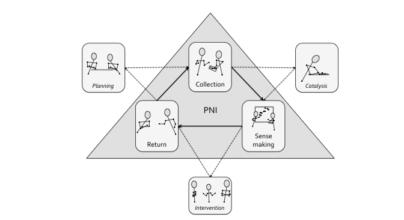
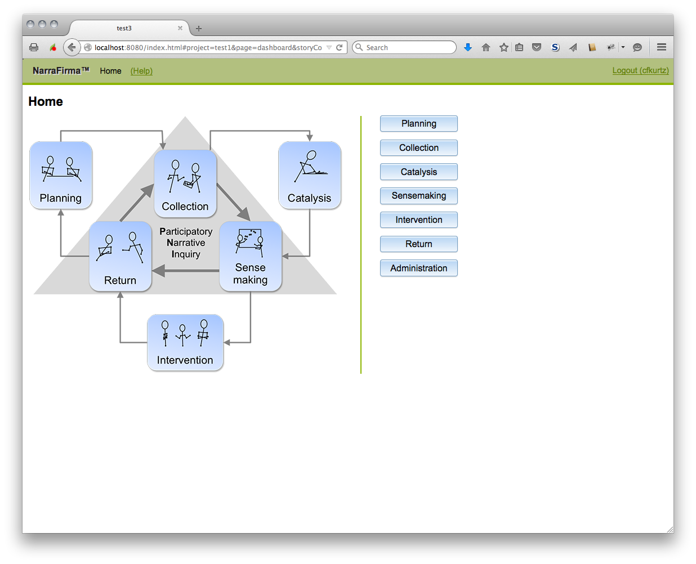
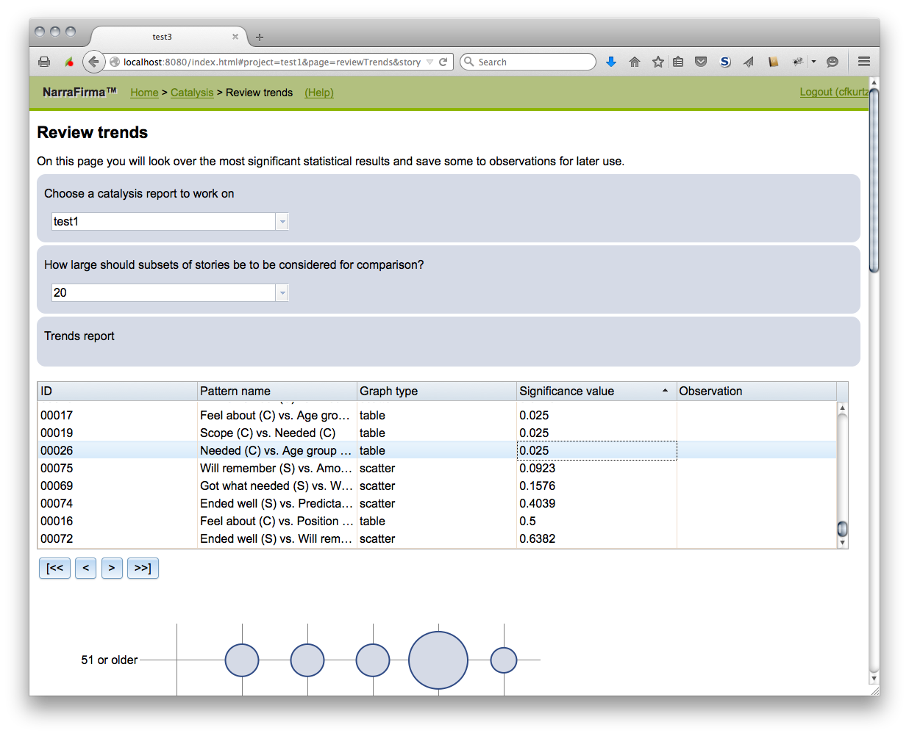

# NarraFirma

A browser-based single-page application to support "grounding actions in stories"

Install either as a WordPress plugin or a NodeJS application.  
License: GPL v2 or any later version.  
See the [website](http://narrafirma.com) for more information.

---

## What is NarraFirma?

The NarraFirma&trade; software helps people who want to use Participatory Narrative Inquiry (PNI) in their communities and organizations.

PNI methods help people discover insights, catch emerging trends, make decisions, generate ideas, resolve conflicts, and connect people.
PNI is described in the textbook ["Working With Stories in your Community or Organization"](http://workingwithstories.org/) by [Cynthia F. Kurtz](http://cfkurtz.com/).

As Malcom Gladwell has [said](http://venturebeat.com/2015/07/24/gladwell-on-data-marketing-the-snapchat-problem-the-facebook-problem-the-airbnb-problem/) about the limits of big data:
"More data increases our confidence, not our accuracy." When "accuracy" is defined not as measurement but as effective, appropriate, meaningful change, PNI helps to increase accuracy in decision making by grounding actions in the experiences of the community or organization. PNI can also work as a complement to other methods of market research, business intelligence, and community engagement.

### Comprehensive

- The NarraFirma software covers all six phases of the PNI process (planning, collection, catalysis, sensemaking, intervention, and return).
- The application has over forty different input screens.
- The application can make suggestions for questions to ask and workshops to run based on planning data you supply.

### Client-side implementation

- Most of the the NarraFirma code implements a web-browser-based single-page application.
- The client-side code is written in TypeScript which is transpiled to JavaScript.
- The application supports supports mult-user editing of content using a message-based triple store approach called "Pointrel".
- Each change to the application state generates a JSON AJAX message.
- Interface building is done using [Mithril](https://lhorie.github.io/mithril/index.html) (an earlier version used Dojo).
- Interactive graphs are drawn using D3.

### Server-side implementation

- Server support is either via a WordPress plugin (written in PHP) or a NodeJS application (written in JavaScript).
- The server-side code mainly implements the "Pointrel" AJAX API for messaging and enforces per-project access controls.
- Data is stored in either SQL database tables (for WordPress, one per project) or flat files (for NodeJS, one directory per project with one JSON file per message).

## Configuring and running the NarraFirma server

- You need to have a TypeScript compiler installed to compile the source (typically via "npm install -g typescript").
- For Node.js, you need to run "tsc" to compile those TypeScript source files to JavaScript before running the Node.js server (or have your IDE do it for you). Otherwise you will get error messages about missing JavaScript files when you open the webapp in your browser.
- For WordPress, the TypeScript compiler is called during the creation of the WordPress zip file.
- For more details on installation or setup of NarraFirma from source see [INSTALL.md](INSTALL.md).
- For more details on installation or setup of NarraFirma from a pre-built distribution, including tips on setting up WordPress or Node.js, see [this webpage](https://narrafirma.com/home/setting-up-narrafirma-on-your-local-computer/).

---

## Trademark

NarraFirma is a trademark of Cynthia F. Kurtz and is used by permission for the main distribution of this software.
See [README-narrafirma-trademark.txt](README-narrafirma-trademark.txt) for the NarraFirma trademark usage policy.

## Developers

The initial NarraFirma design and some of the initial implementation was done by Cynthia F. Kurtz.
Most of the initial NarraFirma implementation was done by Paul D. Fernhout.

## Screenshots

For more screenshots, see [here](screenshots/screenshots-2015-06-18/).
