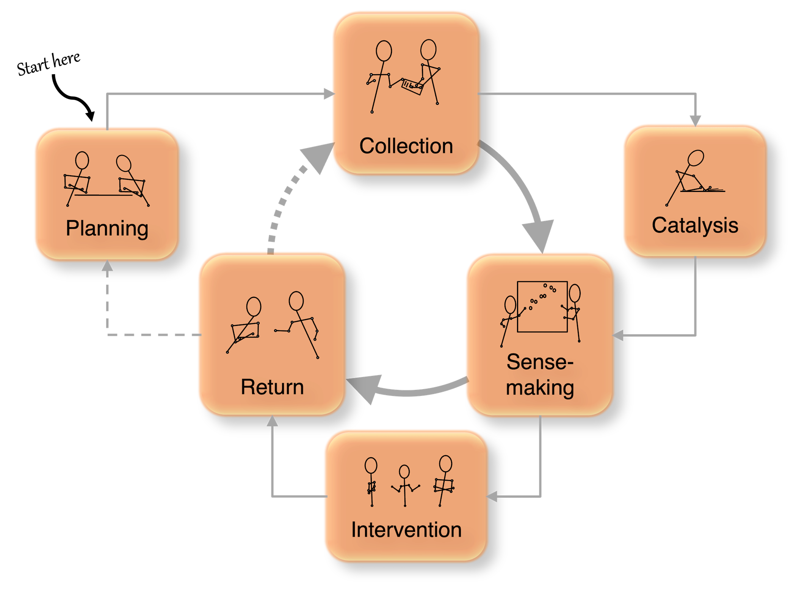
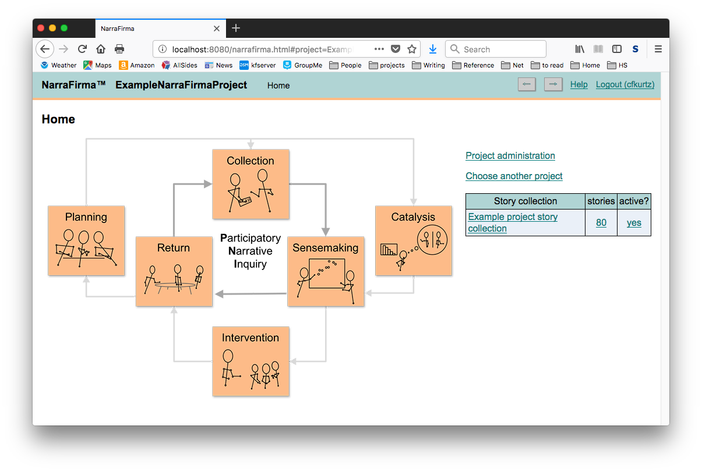
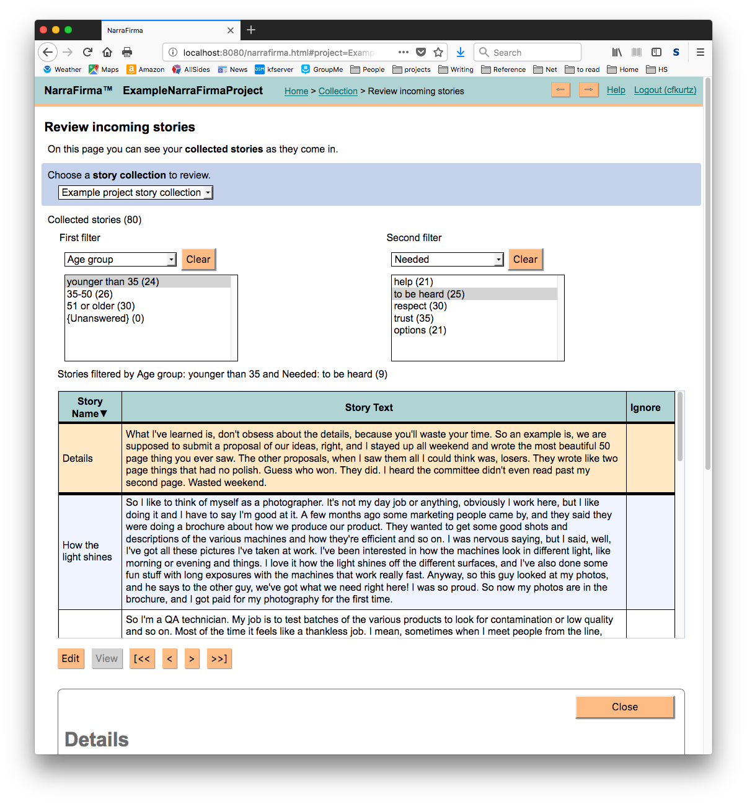

### NarraFirma

NarraFirma is a free and open source web application that supports practitioners of Participatory Narrative Inquiry (PNI). You can install it as a WordPress plugin or a NodeJS application. It is released under the GPL v2+ license. See [narrafirma.com](http://narrafirma.com) for more information.

### What is Participatory Narrative Inquiry?

PNI is a form of Participatory Action Research in which groups of people share and work with their stories of personal experiences to understand each other and to make collective sense of complex issues and situations. You can use it to help the people in your community or organization discover insights, catch emerging trends, make decisions, generate ideas, resolve conflicts, and connect people.

NarraFirma is companion software to the textbook series [*Working With Stories*](http://workingwithstories.org/) by [Cynthia F. Kurtz](http://cfkurtz.com/), which describes PNI in detail. (If you don't want detail, check out the shorter explanation in *Working with Stories Simplified*.)

As Malcolm Gladwell has [said](http://venturebeat.com/2015/07/24/gladwell-on-data-marketing-the-snapchat-problem-the-facebook-problem-the-airbnb-problem/) about the limits of big data:
"More data increases our confidence, not our accuracy." When "accuracy" is defined not as measurement but as effective, appropriate, meaningful change, PNI helps to increase accuracy in decision making by grounding actions in the experiences of the community or organization. 

PNI has been used by hundreds of groups for dozens of years in a variety of contexts from academic research to organizational learning to market research to political activism to community development. It also works well as a complement to other methods of research, engagement, dialogue, and decision support.

### What does NarraFirma do?

Across its 40+ pages, NarraFirma covers all six phases of the PNI process (planning, collection, catalysis, sensemaking, intervention, and return).

NarraFirma users tell us that they value these aspects of NarraFirma: 

- its ability to help them gather stories (and answers to questions about stories) over the internet
- its ability to help them discover graphical and statistical patterns in their data and prepare those patterns for use in group sensemaking workshops
- its reflective questions that help them plan their project and preserve their memories of what happened in it for future reference
- its ability to help project teams collaborate in real time

### Technical details

#### Client-side implementation

- Most of the NarraFirma code implements a web-browser-based single-page application.
- The client-side code is written in TypeScript, which is transpiled to JavaScript.
- NarraFirma supports supports multi-user editing of content using a message-based triple store approach called "Pointrel".
- Each change to the application state generates a JSON AJAX message.
- Interface building is done using [Mithril](https://mithril.js.org/) (an earlier version used Dojo).
- Interactive graphs are drawn using D3.

#### Server-side implementation

- Server support is either via a WordPress plugin (written in PHP) or a NodeJS application (written in JavaScript).
- The server-side code mainly implements the "Pointrel" AJAX API for messaging and enforces per-project access controls.
- Data is stored in either SQL database tables (for WordPress, one per project) or flat files (for NodeJS, one directory per project with one JSON file per message).

#### Configuring and running the NarraFirma server

- For WordPress, the TypeScript compiler is called during the creation of the WordPress zip file.
- For Node.js, have Node.js and npm installed first. Run "npm run build" to compile the TypeScript source files to JavaScript before running the Node.js server (or have your IDE do it for you). Otherwise you will get error messages about missing JavaScript files when you open the web application in your browser.
- For more details on installation or setup of NarraFirma from source see [INSTALL.md](INSTALL.md).
- For more details on installation or setup of NarraFirma from a pre-built distribution, including tips on setting up WordPress or Node.js, see [this webpage](https://narrafirma.com/home/setting-up-narrafirma/).

### More about NarraFirma

### Developers

The initial NarraFirma design and some of the initial implementation was done by Cynthia F. Kurtz. Most of the initial NarraFirma implementation was done by Paul D. Fernhout. Cynthia has maintained (and slowly improved) the software ever since then. 

### Trademark

NarraFirma is a trademark of Cynthia F. Kurtz and is used by permission for the main distribution of this software.
See [README-narrafirma-trademark.txt](README-narrafirma-trademark.txt) for the NarraFirma trademark usage policy.

### Screenshots

Please note that these screenshots are out of date. The basic functionality of the software has not changed, but some of the pages look a little different now.

For more screenshots, see [here](screenshots/screenshots-2017-12-07/).
