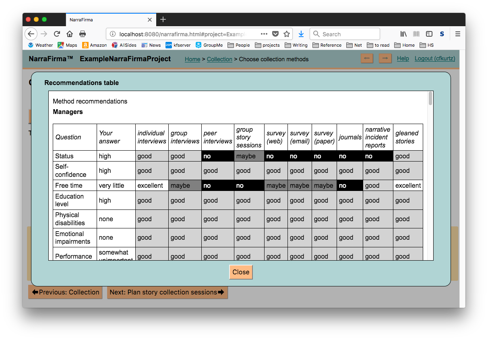
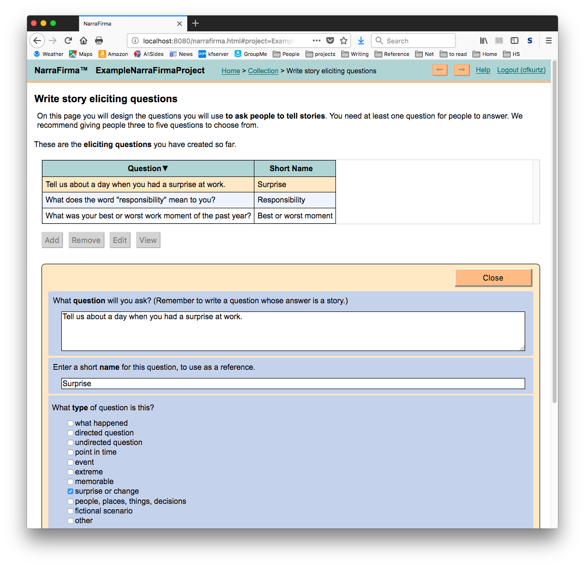
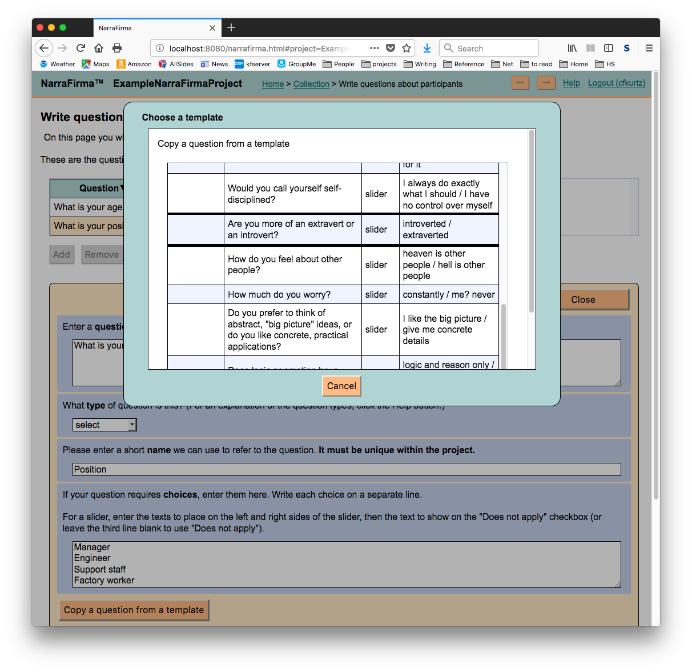
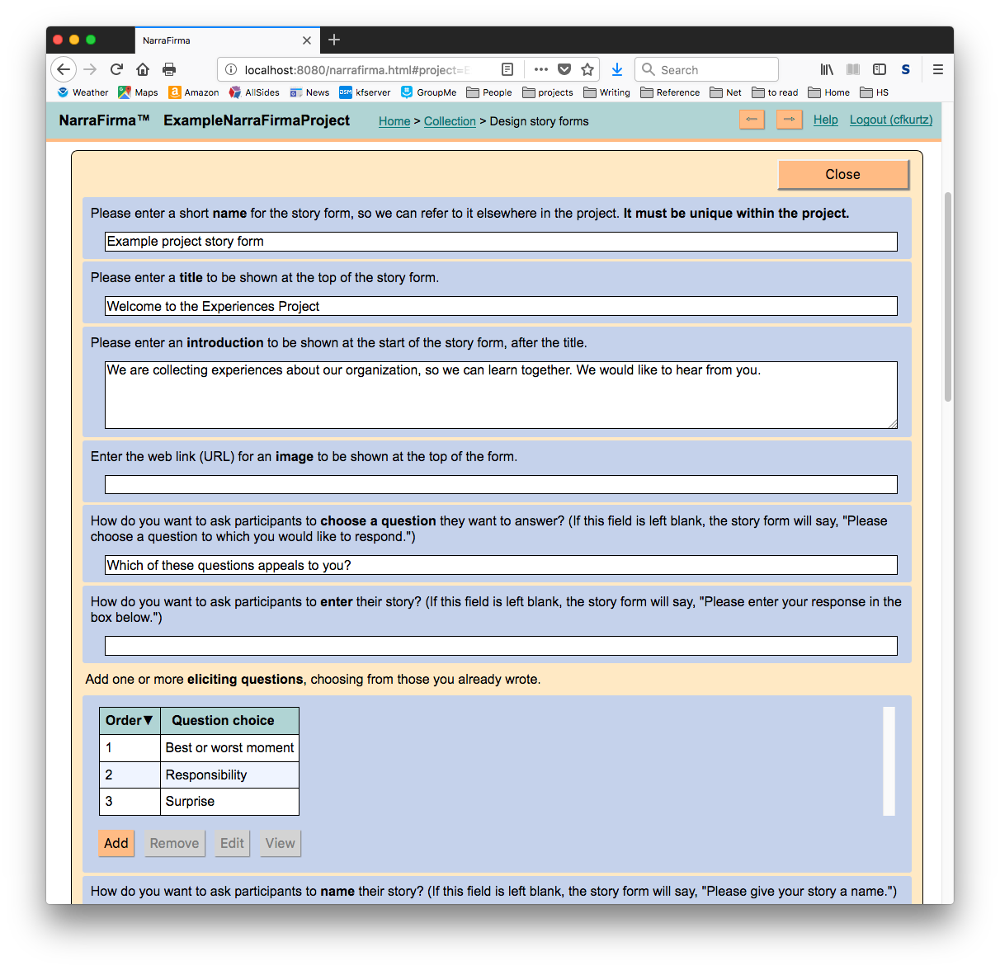
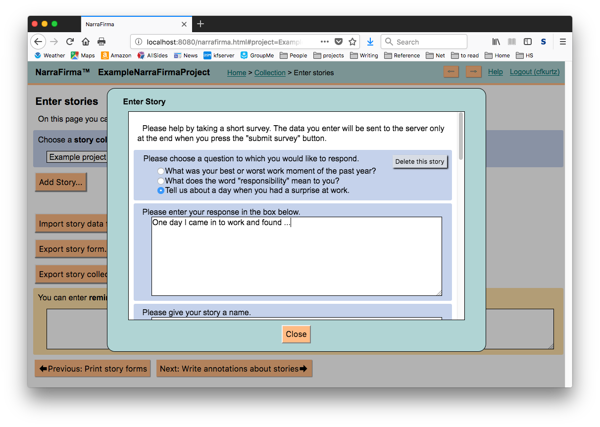
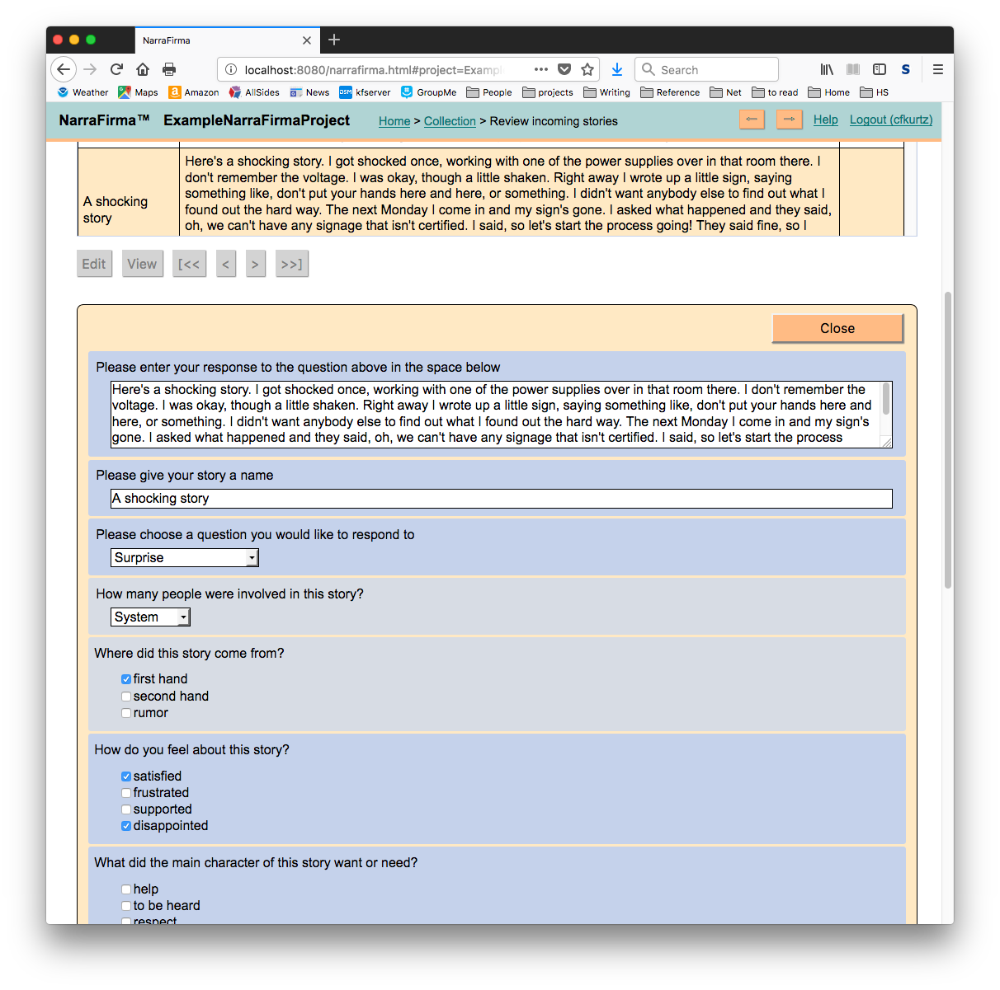

# NarraFirma Screenshots

These screenshots give you an idea of what using the NarraFirma application is like. To learn more about
the ideas behind NarraFirma, visit the web site of its companion book, 
_[Working with Stories](http://www.workingwithstories.org)_.

These screenshots are current as of 2017-12-07.

## Survey

NarraFirma supports project work in [Participatory Narrative Inquiry](http://www.workingwithstories.org).
The software is mostly oriented toward users who are running PNI projects, but participants in a
story project (the people who tell the stories) may interact with NarraFirma through an online
survey. This is what they see. 

**Survey (top)**

**Survey (scrolled down)**

* * *

## NarraFirma Application

**Home page**

This is the home page of the NarraFirma application, where six buttons
 (Planning, Collection, Catalysis, Sensemaking, Intervention, Return),
correspond to the six phases of participatory narrative inquiry. 

* * *

### Planning

In the planning phase of PNI, you think about your project's goals and context, and you make decisions about how you will carry it out.

**Planning - Dashboard**

Each phase of PNI has a "dashboard" page where you can review your progress
and view "reminders" that help you keep track of what you need to do next.

 **Planning - Enter project facts**

 Here you enter some basic details about your project.

**Planning - Describe participant groups**

Here you think about the groups of people you will be asking to tell stories. Sometimes there will be only
one group, but often you will be approaching different groups with different characteristics and needs.
Describing your groups causes NarraFirma to make a series of recommendations about how best to design your project. 

* * *

### Collection

In the collection phase of PNI, as you might expect, you collect stories. This part of the software helps you 
write questions, design the conversations you will have, and review the stories you have collected.

**Collection - Dashboard**

This is the collection phase dashboard, showing all the possible parts of story collection.

**Collection - Recommendations**

There are many ways to collect stories: singly, in pairs, in groups; in person, on the phone, over the web; in speech, in writing. NarraFirma helps 
you decide with recommendations based on your previous description of participant groups.

**Collection - Write eliciting questions**

The first thing to do when you plan to gather stories is to figure out how you will ask people to tell stories.
In PNI we usually start people off by asking them questions that help them recall experiences to mind.
Here the NarraFirma user is designing questions they will ask people to get them started telling stories.

**Collection - Write questions about stories**

In participatory narrative inquiry, we ask people questions about the experiences they tell us about. This gives us 
a deeper understanding of the experiences, because the people themselves interpret the stories they tell. 
In this screenshot the user is reviewing questions they have written to ask people about their stories.

**Collection - Write questions about participants**

In PNI we also ask people direct questions about themselves. The juxtaposition of direct questioning (through "about you" questions)
and indirect, oblique questioning (through "about the story you just told" questions) can help you learn more about how people
feel about a topic. In this example the NarraFirma user is copying a question from the templates
that come with the software.

**Collection - Design story form**

We call the combination of eliciting questions, questions about stories, and questions about participants
a story form. Story forms can be used in interviews, in group sessions, or in written conversations. 

**Collection - Enter stories**

Stories can be entered into NarraFirma in three ways: through a web survey (used by project participants),
through a data entry form (used by project helpers), or through import from a CSV spreadsheet file.
Here a project helper is entering stories collected off-line into NarraFirma.

**Collection - Write annotation questions**

In this screenshot the user is adding extra questions - those not asked of the participants - to be
answered by a researcher or project helper. These are typically the kinds of things that would be called "coding" in qualitative or narrative
analysis, like tone of voice, word choices, whether certain things were mentioned in the story, and so on.

**Collection - Review incoming stories**

Here the user is looking at the stories they have collected. In this view you can filter the stories by
answers to questions. Here the user is looking only at stories told by people younger than 35 who said
the person in their story needed "to be heard".

**Collection - Edit stories**

Here the user is (carefully) editing a collected story. This is so you can 
anonymize stories in place (for example, removing mentions of people's names) and answer annotation questions
(shown in a different color).

* * *

### Catalysis

Catalysis is an optional phase of PNI in which people (sometimes in groups, sometimes alone) look for patterns
in the stories and answers to questions. We call this phase catalysis because its purpose is to catalyze thought and discussion.
NarraFirma streamlines the catalysis process so you can move quickly on to the sensemaking phase of your project.

**Catalysis - Dashboard**

This is the catalysis phase dashboard.

 **Catalysis - Configuration**

 Here the user is making choices that determine how graphs will display on the page that comes next.

 **Catalysis - Explore Patterns - Significance**

 NarraFirma generates all the patterns (graphs and statistical tests) it can (limited by the questions and data types
 you want to consider). You can then sort your list of patterns by statistical significance,
 so you can see at a glance the strongest trends in your data. 
 
The statistical tests used by NarraFirma are:

 * for scale data: mean, median, mode, standard deviation, skewness, kurtosis
 * for choice x choice combinations: chi-square
 * for choice x scale combinations: Mann-Whitney U test
 * for scale x scale combinations: Spearman's correlation coefficient

Only non-parametric tests are used, to be conservative.

 **Catalysis - Explore Patterns - Graph**

 Here the user has selected a pattern, is looking at the associated graph, and has selected
some of the stories shown on the graph. They can see the list of stories selected
 below the graph.

 **Explore Patterns - Observation and Interpretations**

The crux of catalysis in PNI (and the reason it is not catalysis, not analysis) is that for each **observation**
made about a graph (that is, something anyone can see), we write _multiple_ **interpretations**. 
That is, instead of saying "we can see this, and it obviously means this,"
we say "we can see this, and it could mean this, or if you look at it another way, it could mean this."
This practice of _deliberate disagreement_ creates a richer set of materials
to support thought and discussion in the sensemaking phase.

 **Catalysis - Cluster Interpretations**

 At this point in the catalysis process, the user (and remember, this could be a person running a project,
 a group of people running a project, or a whole bunch of people in a workshop) has entered lots of
 interpretations about lots of observations. Now they cluster those interpretations to produce
 a smaller number of **perspectives**.

 **Catalysis - Report**

From the clustered interpretations, observations, and graphs on the previous pages,
NarraFirma generates a catalysis report. It is typically used during a sensemaking session (along with the
collected stories) to spur discussion in groups. You can change how the report looks by
manipulating the CSS classes that determine its appearance.

* * *

### Sensemaking

The sensemaking phase of PNI typically takes place in a workshop setting with a group of people who
make sense of stories and other data together. They may work with a catalysis report, but they _always_ work with stories.
A sensemaking session may be long and complex, with several structured exercises, or it can be short and/or simple.
In either case, the people involved (including some of those who told stories) are included in the session
when possible.

**Sensemaking - Dashboard**

This is the sensemaking dashboard page.

 **Sensemaking - Plan sensemaking session**

 Here the user is planning a sensemaking session. (Not shown is the screen where the user records what went on at the session afterward.)

 **Sensemaking - Copy activity from template**

 NarraFirma includes a list of templates you can copy (based on exercises developed as part of PNI)
 and plan into your sensemaking session. (There are similar templates for story collection sessions,
 questions about stories, and questions about participants.) 

* * *

### Intervention

The intervention phase of PNI is about _changing the stories people tell_. NarraFirma follows the ideas
for narrative interventions described in _[Working with Stories](http://www.workingwithstories.org)_.
Some examples are:

 * Setting up a story sharing space
 * Creating a narrative suggestion box
 * Building a narrative learning resource
 * Holding a participatory theatre event
 * Supporting narrative mentorship

**Intervention - Dashboard**

This is the intervention dashboard.

 **Intervention - Answer questions about project outcomes**

 Here the user is describing how the project played out for each of their participant groups. This will help
 NarraFirma suggest interventions that might be helpful to that group. (Not shown are screens where
 you can plan interventions and record what happened when you carried them out.)

* * *

### Return

The return phase of PNI is all about follow-through. In the return phase the stories return to the community (whether
or not you are paying attention) and people process what happened in the project, which is its own story.

**Return - Dashboard**

This is the return phase dashboard.

**Return - Gather feedback**

On this screen you can record feedback you got from people about the project, both to help them process
what happened and to help you learn from it.

 **Return - Reflect on the project**

 On this screen there is a place to reflect in general on the entire project
 and save your reflections so you can learn from them years later, when you have forgotten
 the details of what you worked on.

**Conclusion**

And that's NarraFirma. To try out a NarraFirma installation yourself,
visit [the NarraFirma web site](https://www.narrafirma.com) and click "Try it". 